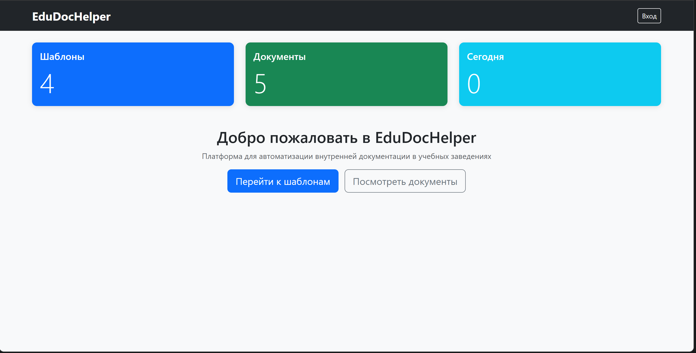
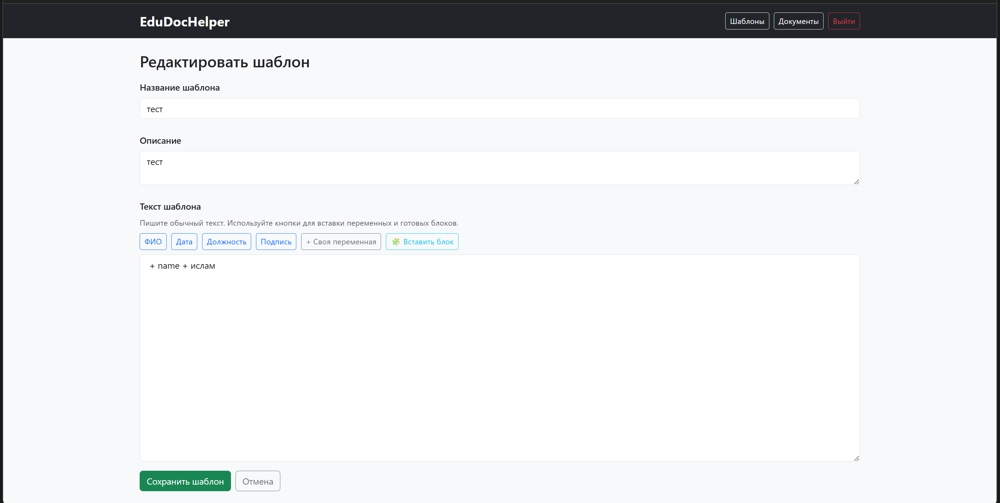
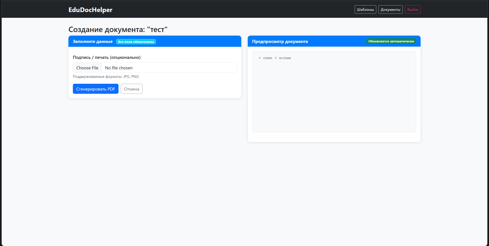

# EduDocHelper 🚀


**A web-based application for creating, editing, and generating dynamic PDF document templates with signatures.**
Designed for educational and organizational workflows, focusing on usability and flexibility.

---

## 📸 Screenshots






---

## 📁 Project Structure
```
edudochelper/
├── app.py                  # Main Flask logic
├── config.py               # App/server configuration
├── forms.py                # Web forms
├── models.py               # Database models
├── utils.py                # PDF generation and helper functions
├── requirements.txt        # Dependency list
├── Dockerfile              # Docker setup
├── docker-compose.yml      # Multi-container configuration
├── test.py                 # Automated tests
│
├── instance/
│   └── edudochelper.sqlite # SQLite database
│
├── output/
│   └── groups.txt          # Output files
│
├── uploads/                # User uploads
│
├── static/
│   ├── css/
│   │   └── style.css       # Stylesheet
│   ├── img/
│   │   └── logo.png        # Logo
│   └── js/
│       └── main.js         # JavaScript
│
├── templates/              # HTML templates
│   ├── base.html
│   ├── index.html
│   ├── login.html
│   ├── template_edit.html
│   ├── template_generate.html
│   ├── generated_list.html
│   └── templates_list.html
│
└── fonts/                  # PDF fonts
```


---

## 🛠️ Tech Stack
- **Python 3.11+**
- **Flask** (Web backend)
- **SQLite** (Database)
- **Docker/Docker-Compose** (Deployment)

---

## ⚡ Installation

### Local Setup
```bash
git clone https://github.com/YOUR_GITHUB/edudochelper.git
cd edudochelper
python -m venv venv
# For Windows:
venv\Scripts\activate
# For Mac/Linux:
source venv/bin/activate
pip install -r requirements.txt
python app.py
---
```
### App runs at: http://127.0.0.1:5000
### Docker Setup
```
docker build -t edudochelper .
docker-compose up
```

## ⚙️ Configuration
Edit configuration in:
- `config.py`
- `docker-compose.yml`

**Key Parameters:**
- `SECRET_KEY`
- `SQLALCHEMY_DATABASE_URI`
- `UPLOAD_FOLDER`, `SIGN_FOLDER`, `PDF_FOLDER`

---

## 📦 Dependencies

| Library            | Purpose                     |
|--------------------|-----------------------------|
| Flask              | Web framework               |
| Flask-SQLAlchemy   | ORM (Database)              |
| Flask-WTF, WTForms | Web forms                   |
| reportlab          | PDF generation              |
| python-dotenv      | Environment configurations  |

---

## 🎮 Usage Instructions
1. **Login/Register:** Access the app and authenticate.
2. **Create/Edit Templates:** Use the UI to build reusable documents.
3. **Generate PDFs:** Fill in fields and upload signatures.
4. **Download/Manage:** Retrieve your finished files.

---

## 👤 Default Credentials
- **Username:** `admin`
- **Password:** `admin`

⚠️ **Change after first use for security!**

---

## ✅ Verification & Testing
Run automated tests:
```bash
python test.py
```

**Manual Checks:**
- Login
- Create/edit a template
- Generate and download a PDF
- Search/delete documents
- Confirm error and success messages

---

## 🌐 GitHub Repository
Track, update, and share the code:
[https://github.com/Girlfriend009/edudochelper](https://github.com/Girlfriend009/edudochelper)

---

## 📚 Libraries & Fonts
- See `requirements.txt` for libraries.
- Fonts in `/fonts/` are open-license.

---

## 🆘 Support
For questions or bugs:
- Open a GitHub issue
- Contact: [Your email/contact info]

---

## 🎥 Demo
https://youtu.be/ky7xXSOBGvQ


